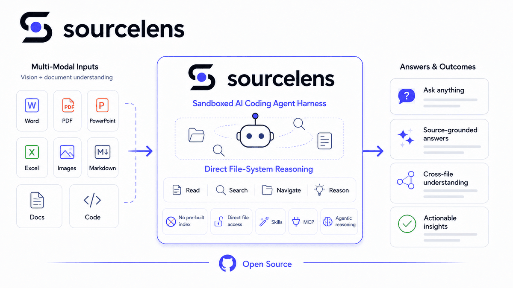
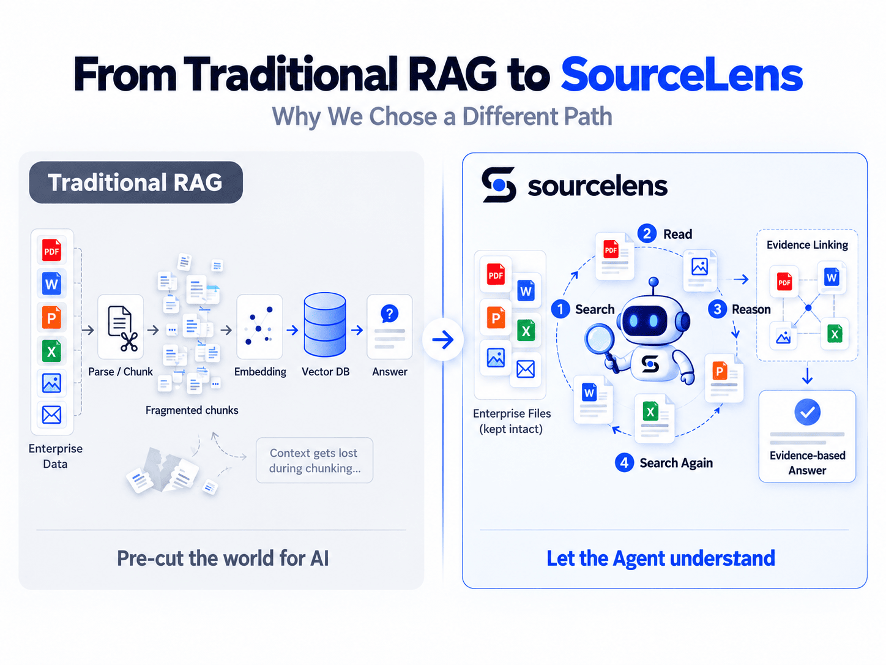
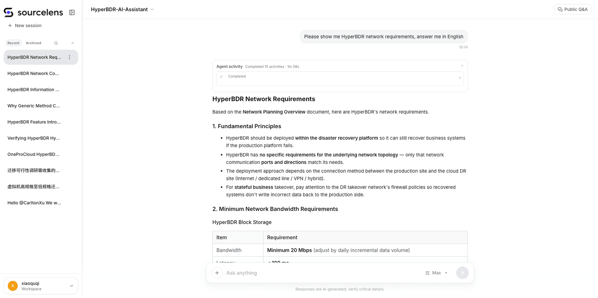
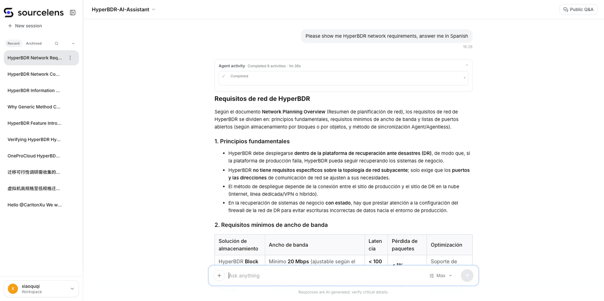

<div align="center">

<picture>
  <source media="(prefers-color-scheme: dark)" srcset="frontend/public/brand/logo_with_text_dark.png">
  
</picture>

[English](README.md) | [中文](README.zh-CN.md)

**Harness-based Agentic RAG** — no embeddings, no vector DB, no pre-indexing

[](LICENSE)
[](https://www.python.org/)
[](https://www.django-rest-framework.org/)
[](https://vuejs.org/)
[](https://docs.docker.com/compose/)
[](https://github.com/oneprolabs/sourcelens/pulls)

[**Quick Start**](#-quick-start) · [**Why SourceLens**](#why-sourcelens) · [**What We Believe**](#-what-we-believe) · [**Local Development**](#-local-development) · [**Community**](#-community--contact)

</div>

**SourceLens** is Agentic RAG built on an AI coding agent harness — the same kind of harness behind tools like Cursor, Claude Code, or Codex, not those products themselves — running inside a sandboxed environment. Instead of embedding your files into a vector index ahead of time, SourceLens hands them directly to the agent harness, which reads, searches, and reasons over the file system on demand — turning any pile of documents or code into something you can just ask questions of.



Instead of vector embeddings or keyword indexes, SourceLens uses AI coding agents running in a sandbox to directly read, navigate, and reason over the file system. This means the retrieval understands code structure, cross-file relationships, and semantic intent — not just surface-level text matching.

## Background

Our first attempts at RAG used graphical workflow tools like Dify and n8n. They asked a lot of the people building on them, and the real difficulty was always upfront: splitting documents and embedding them before they ever reached a vector store. That prep work took real effort to get right, and even after all of it, recall accuracy stayed disappointing — answers would come back incomplete, sometimes missing the point that was in the document all along.



Around the same time, we noticed something different from using Cursor for development: it did no pre-training or pre-indexing at all, yet it was consistently accurate at reasoning over a codebase. That raised an obvious question — why not use the same approach for RAG?

That's the idea behind SourceLens: instead of the embed-then-retrieve pipeline, hand documents and code straight to an AI coding agent harness — the same kind of logic behind Cursor, Claude Code, or Codex — and let it read and reason over them directly. In practice we've found the answers come back more accurate, more precise, and more concise than what the traditional RAG pipeline produced, and that experience is what turned into this project.

Most teams building a RAG knowledge base today go through some version of this same graphical-orchestration pipeline — tools like Dify, n8n, Coze, or FastGPT, wired up to a vector store. SourceLens's core goal is to drive the cost of standing up a working RAG system as close to zero as possible, without trading away answer quality.

The underlying loop stays deliberately simple: a query triggers the agent to search, it synthesizes what it finds into a partial answer, and if that's not enough, it searches again and synthesizes again — repeating until it can answer with confidence. Skills and MCP integration are the planned path for extending what the agent can reach beyond the local file system, without changing that core loop.

## 🚀 Quick Start

### 1. Prerequisites

| | |
|---|---|
| CPU / RAM | 4 cores · 8 GB |
| Disk | 100 GB recommended |
| Docker | Compose V2 (`docker compose`), installed and running |
| OS | Linux · macOS or Windows via Docker Desktop |

You also need API keys for two models:

| Role | Requirement | Example |
|---|---|---|
| Chat & retrieval | Drives the agent loop and answer synthesis | `deepseek-flash` |
| Image understanding | Must support vision input — screenshots, images in documents | `deepseek-flash`, `gpt-5.2`, `qwen-vl-max` |

### 2. Install

**Linux / macOS**

```bash
curl -fsSL \
  https://raw.githubusercontent.com/oneprolabs/sourcelens/main/install.sh \
  | sudo bash
```

**Windows (Git Bash)** — not PowerShell or CMD

```bash
curl -fsSL \
  https://raw.githubusercontent.com/oneprolabs/sourcelens/main/install.sh \
  | bash
```

**China network** — release files from Gitee, images from Aliyun ACR

```bash
curl -fsSL \
  https://gitee.com/oneprolabs/sourcelens/raw/main/install.sh \
  | sudo bash -s -- --channel cn --download-source gitee --yes
```

### 3. Verify

```bash
curl -f http://<host>:10083/health
```

### 4. Sign in

Open `http://<host>:10083`. User `admin`, password in
`<install-dir>/install-info.env`.

<details>
<summary><b>Options and notes</b></summary>

| Option | Description |
|---|---|
| `--dir DIR` | Install directory |
| `--port` / `--https-port` | Ports (default `10083` / `10443`) |
| `--domain HOST` | Public hostname or IP |
| `--version VER` | Install or upgrade to a specific release |
| `--channel github\|cn` | Distribution channel (auto-detected) |
| `--yes` | Non-interactive; skips the model setup prompt |

Default install dir: `/opt/sourcelens` (Linux), `/Users/Shared/sourcelens`
(macOS), `$HOME/sourcelens` (Windows Git Bash). `install.sh --help` lists the
rest.

Re-running with a newer `--version` upgrades in place; `.env` and data are
preserved. A fresh install takes the latest release tag.

An interactive install with no active model prompts you to configure one and
tests the connection before saving. Skip with `--yes` and configure later at
`/management/llm/config`.

- **NAT VMs**: forward host TCP `10083` to guest TCP `10083`.
- **Zero-downtime upgrades**: [`docs/blue-green-deployment.md`](docs/blue-green-deployment.md).

</details>

## Why SourceLens

- **Agentic RAG, not embeddings** — an agent harness (the same kind behind Cursor, Claude Code, Codex, etc.) reads and reasons over files directly, no vector DB, no pre-indexing step
- **Sandboxed execution** — all agent operations run in isolated environments, safe for arbitrary codebases and documents
- **Pre/post LLM orchestration** — customizable LLM steps before and after retrieval for query refinement and answer synthesis
- **Source-traceable** — every answer references exact file paths and code locations
- **Works with any format** — Markdown, Word, PPT, images, and code (py, js, ts, vue, go, etc.), with zero prep

### How is this different from Codex or Work Buddy?

Same foundation — a harness agent with a working environment — different
starting point.

| | Codex / Work Buddy | SourceLens |
|---|---|---|
| **Starts from** | One person's local files | A company's shared data |
| **Setup** | Each user installs a runtime and configures a model | Admin configures once; users open a URL |
| **Governance** | None needed for a personal tool | Per-assistant sources, access control, traceable answers |

SourceLens's unit is the **Assistant**. Admins decide what it mounts, which
model it runs, who can reach it, and how deep retrieval goes. Users get one
thing they can open and ask — and an answer that traces back to a specific
file.

## 💡 What We Believe

**A harness agent is becoming the general-purpose way to work with AI.** The
design question is moving from "how do we call the model one fewer time" to
"how do we give the agent enough context, tools, and room to act that it gets
the problem right."

**Inference keeps getting cheaper, so saving a model call is the wrong thing to
optimize for.** Chunking, embedding, vector stores, rerankers — all fixed cost,
paid once to build and then forever to maintain. Letting the agent do the
judging is variable cost, and it drops every time models get stronger and
cheaper.

Personal agent tools optimize for one person finishing a task. We optimize for
turning a company's data into AI context that is durable, governable, and
reusable — across people, assistants, and eventually harnesses.

## Use Cases

Three scenarios from how we use SourceLens internally today:

### 1. RAG over documents — no embedding step required

Point SourceLens at documents in any of these formats and start asking questions immediately — no pre-indexing, no embedding pipeline to run first:

- Markdown exported from online docs platforms (e.g. ViewPress)
- Word documents
- PowerPoint decks
- Content inside images



Ask in whatever language you like — the answer follows your question, not the
language the documents were written in.



### 2. Deep code insight from a screenshot

Hit an error? Paste a screenshot of it and let the agent harness trace it back through the actual source — a deep, source-level investigation instead of just matching the error string.

### 3. Company-wide Skills as a universal chat interface

We package internal engineering knowledge as company-level Skills that anyone can use to find and diagnose problems, exposed as one universal chat mode:

- **No install** — nothing to set up in a local tool first
- **Answer online** — ask in a chat session and get the answer directly
- **Generate & download** — the same session can generate a file and hand it back to you

> Also fun in testing: pointing the same deep-insight flow at long-form content like novels turns out to be a surprisingly effective way to explore and query them.

## 🛠 Local Development

The dev stack builds from source and hot-reloads.

> **Prerequisite:** Docker Compose **V2** (`docker compose`) is required. The dev
> stack relies on Compose V2 features — the top-level `name` field (dev/prod
> project isolation), `pull_policy`, and `depends_on.condition` health gating —
> that legacy Docker Compose v1 (`docker-compose`, e.g. 1.29.x) rejects with a
> schema error on `up -d`. Verify your version with `docker compose version`.

```bash
cp env.sample .env.dev
# Edit .env.dev — database, AI service keys, etc.
docker compose -f docker-compose.dev.yml up -d
```

Everything is served on **http://localhost:8000** — frontend and API both sit
behind the dev nginx.

Code is bind-mounted, so reload behavior differs per service:

| Service | Container | After a code change |
|---|---|---|
| `backend-api` | `sourcelens-api-dev` | Reloads automatically |
| `backend-worker` | `sourcelens-worker-dev` | `docker restart sourcelens-worker-dev` |
| `backend-scheduler` | `sourcelens-scheduler-dev` | `docker restart sourcelens-scheduler-dev` |

New migrations are the one case that needs an API restart.

## 📄 License

[Apache License 2.0](LICENSE)

## 💬 Community & Contact

- [GitHub Issues](https://github.com/oneprolabs/sourcelens/issues) — questions and bug reports
- [GitHub Discussions](https://github.com/oneprolabs/sourcelens/discussions) — ideas and design discussion
- [hyperfilelens.com](https://hyperfilelens.com) — product site
- [X / Twitter @oneprolabs](https://x.com/oneprolabs) — releases and updates
- Email — [opensource@oneprocloud.com](mailto:opensource@oneprocloud.com)

**WeChat group** — scan to join:


If SourceLens is useful to you, a ⭐ helps other people find it.

---

<sub>SourceLens is built and maintained by [OnePro Cloud](https://github.com/oneprolabs).</sub>
