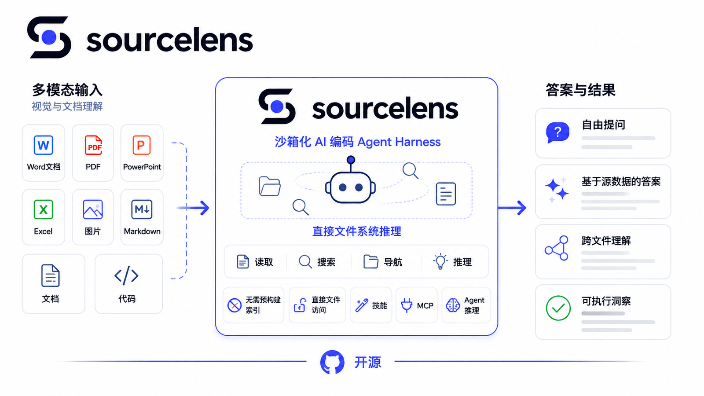
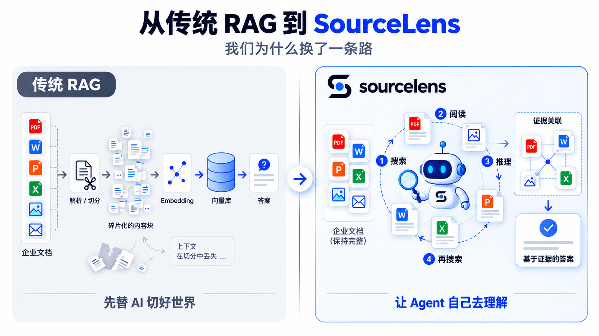
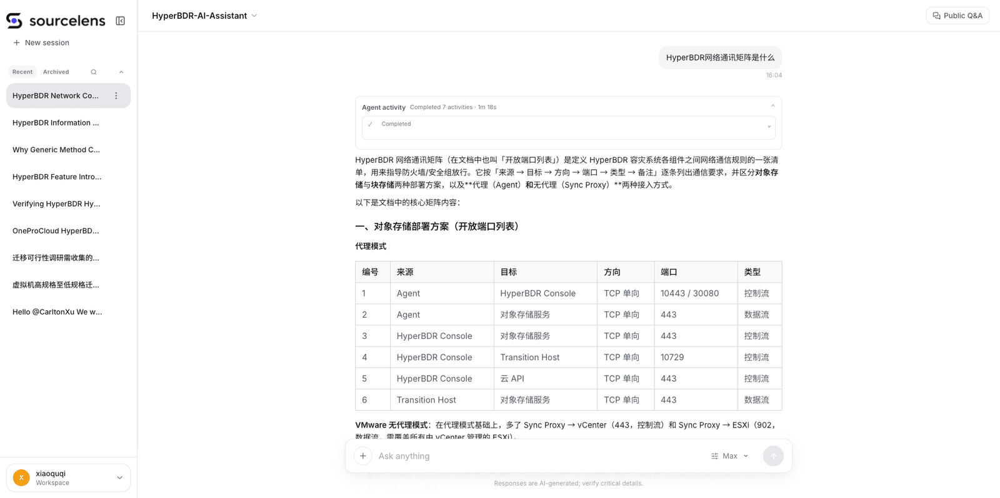
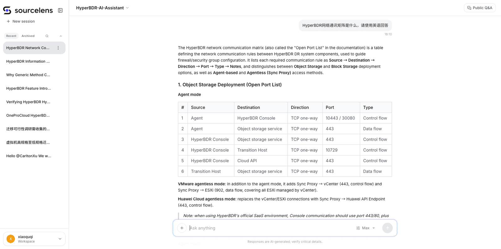

<div align="center">

<picture>
  <source media="(prefers-color-scheme: dark)" srcset="frontend/public/brand/logo_with_text_dark.png">
  
</picture>

中文 | [English](README.md)

**基于 Harness 的 Agentic RAG** — 无需 embedding，无需向量数据库，无需提前建索引

[](LICENSE)
[](https://www.python.org/)
[](https://www.django-rest-framework.org/)
[](https://vuejs.org/)
[](https://docs.docker.com/compose/)
[](https://github.com/oneprolabs/sourcelens/pulls)

[**快速安装**](#-快速安装) · [**为什么选择 SourceLens**](#为什么选择-sourcelens) · [**我们相信什么**](#-我们相信什么) · [**本地开发**](#-本地开发) · [**社区**](#-社区与联系我们)

</div>

**SourceLens** 是一套基于 Harness 的 Agentic RAG（Agentic Retrieval-Augmented Generation）方案：底层由一套 AI 编程 agent harness 驱动（跟 Cursor、Claude Code、Codex 背后是同一类 harness，但并非直接集成这些产品本身），在沙箱环境中运行。它不需要提前把文件做 embedding 建成向量索引，而是直接把文档和代码交给 agent harness，由其在文件系统上按需读取、检索、推理——让任意一堆文档或代码都能直接拿来问问题。



区别于向量嵌入或关键词索引，SourceLens 让 AI 编程 agent 在沙箱中直接读取、导航和推理文件系统。这意味着检索过程能够理解代码结构、跨文件关系和语义意图，而非仅停留在表层文本匹配。

## 项目背景

我们最早做 RAG 用的是 Dify、n8n 这类图形化编排工具。这类工具对使用者的专业要求很高，而真正的难点始终在前期：文档要先拆分、做 embedding，才能存入向量库。这一步准备工作要做好并不容易，投入了不少精力之后，召回的准确率却始终不太理想——回答经常不完整，有时候明明文档里写着答案，却还是会被漏掉。



差不多同一时期，我们在用 Cursor 做开发时注意到一件不一样的事：它完全没有做任何预训练或者预先建索引的动作，但在代码库上推理、回答问题的准确度却一直很稳。这就带来一个很自然的问题——既然如此，为什么不能把这套思路用在 RAG 上？

这就是 SourceLens 的由来：不走"先 embedding、再检索"这条传统路径，而是把文档和代码直接交给 AI 编程 agent harness——跟 Cursor、Claude Code、Codex 背后是同一套逻辑——让它直接读取、推理。实际用下来，我们发现答案的准确度、精确度和简练程度，都明显好过传统 RAG 方式的效果，这段经历也就变成了现在这个项目。

现在大多数团队搭建 RAG 知识库，走的基本都是这一类图形化编排工具的路径——Dify、n8n、Coze（扣子）、FastGPT 之类的工具，接上一个向量库。SourceLens 的核心目标不一样：把搭建一套能跑起来的 RAG 系统的成本尽量压到接近于零，同时不牺牲回答质量。

底层逻辑刻意保持简单：一个 Query 触发 agent 去检索，把找到的内容总结成阶段性答案；如果还不够，就再检索、再总结，如此循环，直到能够给出有把握的回答。未来会通过集成 Skills 和 MCP，在不改变这个核心循环的前提下，扩展 agent 能够触达的边界，不再局限于本地文件系统。

## 🚀 快速安装

### 1. 准备

| | |
|---|---|
| CPU / 内存 | 4 核 · 8 GB |
| 磁盘 | 推荐 100 GB |
| Docker | Compose V2（`docker compose`），已安装并运行 |
| 操作系统 | Linux · macOS 或 Windows（Docker Desktop） |

另外需要准备两个模型的 API Key：

| 用途 | 要求 | 示例 |
|---|---|---|
| 对话与检索 | 驱动 agent 循环和答案合成 | `deepseek-flash` |
| 图片识别 | 需支持视觉输入——截图、文档内图片 | `deepseek-flash`、`gpt-5.2`、`qwen-vl-max` |

### 2. 安装

**Linux / macOS**

```bash
curl -fsSL \
  https://raw.githubusercontent.com/oneprolabs/sourcelens/main/install.sh \
  | sudo bash
```

**Windows（Git Bash）** —— 不要用 PowerShell 或 CMD

```bash
curl -fsSL \
  https://raw.githubusercontent.com/oneprolabs/sourcelens/main/install.sh \
  | bash
```

**国内网络** —— 发布文件走 Gitee，镜像走阿里云 ACR

```bash
curl -fsSL \
  https://gitee.com/oneprolabs/sourcelens/raw/main/install.sh \
  | sudo bash -s -- --channel cn --download-source gitee
```

### 3. 验证

```bash
curl -f http://<host>:10083/health
```

### 4. 登录

打开 `http://<host>:10083`，用户名 `admin`，密码在
`<安装目录>/install-info.env`。

<details>
<summary><b>常用参数与其他说明</b></summary>

| 参数 | 说明 |
|---|---|
| `--dir DIR` | 安装目录 |
| `--port` / `--https-port` | 端口（默认 `10083` / `10443`） |
| `--domain HOST` | 对外域名或 IP |
| `--version VER` | 安装或升级到指定版本 |
| `--channel github\|cn` | 分发渠道（默认自动探测） |
| `--yes` | 非交互模式，跳过模型配置 |

默认安装目录：Linux `/opt/sourcelens`，macOS `/Users/Shared/sourcelens`，
Windows Git Bash `$HOME/sourcelens`。其余参数见 `install.sh --help`。

换更新的 `--version` 重跑即为原地升级，`.env` 和数据都会保留。全新安装取最新发
布 tag。

交互式安装时若没有可用模型，脚本会引导配置一个，并在保存前测试连通性。加
`--yes` 可跳过，之后在 `/management/llm/config` 里配。

- **NAT 虚拟机**：把宿主机 TCP `10083` 转发到虚拟机 TCP `10083`。
- **零停机升级**：见 [`docs/blue-green-deployment.md`](docs/blue-green-deployment.md)。

</details>

## 为什么选择 SourceLens

- **Agentic RAG，而非 embedding** — agent harness（跟 Cursor、Claude Code、Codex 背后是同一类 harness）直接读取并推理文件，无需向量数据库，无需提前建索引
- **沙箱隔离执行** — 所有 agent 操作在隔离环境中运行，安全处理任意代码仓库和文档
- **LLM 前后置编排** — 检索前后可配置 LLM 步骤，优化查询理解与答案合成
- **来源可追溯** — 每个答案精确关联到源文件路径和代码位置
- **任意格式，零准备** — Markdown、Word、PPT、图片、代码（py, js, ts, vue, go 等）都能直接用

### 和 Codex、Work Buddy 这类工具有什么区别？

底座相同——给 Agent 一个工作环境——但出发点不同。

| | Codex / Work Buddy | SourceLens |
|---|---|---|
| **出发点** | 个人本地文件 | 企业共享数据 |
| **使用门槛** | 每个用户各自装环境、配模型 | 管理员配一次，用户打开网页 |
| **数据治理** | 个人工具不需要 | 按 Assistant 管数据源、访问权限、答案可溯源 |

SourceLens 的基本单位是 **Assistant**。挂哪些数据源、用什么模型、谁能访问、检索
走多深，都由管理员决定；用户拿到的只有一个能打开提问的助手，和一个能追溯到具体
文件的答案。

## 💡 我们相信什么

**Harness Agent 会成为一种通用的 AI 工作模式。** 系统设计的重点正在从"少调用一
次模型"，转向"给 Agent 足够完整的 Context、工具和行动空间，让它把问题真正做对"。

**推理成本会持续下降，所以"省一次模型调用"是个错误的优化目标。** 切分、
embedding、向量库、重排——这些全是固定成本，建一次、然后长期维护。把判断交给
Agent 是可变成本，模型每变强、变便宜一次，它就自动降一次。

个人 Agent 工具优化的是一个人把一件事做完；我们优化的是把企业数据变成一套长期
可管理、可授权、可复用的 AI Context，让不同的人、不同的助手，乃至不同的 Harness
都能用。

## 使用场景

以下是我们内部目前在用的三个典型场景：

### 场景一：文档 RAG —— 无需提前 embedding

把文档丢给 SourceLens，无需任何提前的 embedding 工作，直接就能开始提问，支持：

- 来自 ViewPress 等线上文档平台的 Markdown
- Word 文档
- PPT 文档
- 图片中的内容



用什么语言提问都可以——答案跟随你的提问语言，而不是文档本身的语言。



### 场景二：截图驱动的代码深度洞察

发现一个报错？直接截图错误内容，agent harness 会顺着截图深入代码源头做筛查，而不只是做字符串层面的错误匹配。

### 场景三：公司级 Skills 的通用对话模式

我们把内部工程知识沉淀成公司级 Skills，任何人都能基于它发现和定位问题，统一收敛成一种通用对话模式：

- **无需安装** — 不需要在本地工具里提前装这个 Skills
- **在线获取答案** — 直接在对话里提问，答案当场拿走
- **生成与下载** — 同一个对话还能帮你生成文件并下载

> 另一个测试中发现的有趣场景：把同样的深度洞察能力用在小说等长文本内容上，也是一种很有意思的探索和检索方式。

## 🛠 本地开发

开发栈从源码构建，改动热加载。

> **前置要求**：必须使用 Docker Compose **V2**（`docker compose`）。开发栈依赖
> Compose V2 特性——顶层 `name` 字段（dev/prod 项目隔离）、`pull_policy` 和
> `depends_on.condition` 健康门控——旧版 Docker Compose v1（`docker-compose`，
> 如 1.29.x）会在 `up -d` 时因 schema 校验报错而拒绝。可用
> `docker compose version` 确认版本。

```bash
cp env.sample .env.dev
# 按需编辑 .env.dev，配置数据库、AI 服务密钥等
docker compose -f docker-compose.dev.yml up -d
```

所有服务统一挂在 **http://localhost:8000**，前端和 API 都在开发用 nginx 后面。

代码以 volume 挂载，改动生效方式按服务区分：

| 服务 | 容器名 | 代码改动后 |
|---|---|---|
| `backend-api` | `sourcelens-api-dev` | 自动重载 |
| `backend-worker` | `sourcelens-worker-dev` | `docker restart sourcelens-worker-dev` |
| `backend-scheduler` | `sourcelens-scheduler-dev` | `docker restart sourcelens-scheduler-dev` |

唯一需要重启 api 的场景是新增了 migration。

## 📄 开源协议

[Apache License 2.0](LICENSE)

## 💬 社区与联系我们

- [GitHub Issues](https://github.com/oneprolabs/sourcelens/issues) —— 提问与报障
- [GitHub Discussions](https://github.com/oneprolabs/sourcelens/discussions) —— 想法与设计讨论
- [hyperfilelens.com](https://hyperfilelens.com) —— 产品官网
- [X / Twitter @oneprolabs](https://x.com/oneprolabs) —— 版本与动态
- 邮箱 —— [opensource@oneprocloud.com](mailto:opensource@oneprocloud.com)

**微信交流群** —— 扫码加入：


如果 SourceLens 对你有帮助，欢迎点个 ⭐。

---

<sub>SourceLens 由 [OnePro Cloud](https://github.com/oneprolabs) 开发和维护。</sub>
